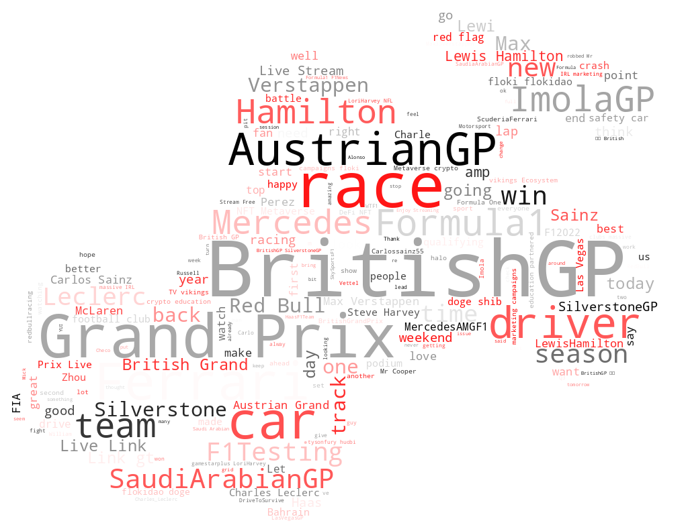

# F1 Word Cloud Visualization

## Project: Word Cloud Visualization of F1 Trending Tweets

This project is a deep dive into creating word clouds using trending tweets related to Formula 1, focusing on the first half of the 2022 season. It accompanies the Medium post [**Deep Dive into Word Cloud Creation**](https://medium.com/@nayeonkn0330/deep-dive-into-word-cloud-creation-c2fc7fc09c12) and provides both Jupyter Notebook and Python script formats of the same code, offering flexibility for interactive use or direct execution.

## Files

1. **`generate_wordcloud.ipynb`**  
   - A Jupyter notebook with code to generate the word cloud.
   - Step-by-step guide with inline visualizations for easy modification and experimentation.
   - Ideal for users who prefer interactive analysis in Jupyter or Colab.

2. **`generate_wordcloud.py`**  
   - A Python script version of the same code for direct execution.
   - Can be run from the command line or incorporated into a larger Python-based workflow.
   - Ideal for users looking for automation or simple command-line execution.

## Features

- **Basic EDA**: Perform simple analysis and cleaning of the F1 tweets dataset to understand key patterns.
- **Word Cloud Visualization**: Create a visual representation of the most frequent words in F1-related tweets.
   - **Stopword Filtering**: Remove common words (like "the", "is", etc.) to focus on the most important words in the tweets.
   - **Custom Colormaps**: Adjust the word cloud's appearance using different color schemes from `matplotlib` and user-defined colormaps.
   - **Image Masking**: Shape the word cloud using a custom image mask, allowing words to form specific shapes (e.g., racing car).

## Data Source

The project uses the **Formula 1 (F1) Trending Tweets dataset** from Kaggle. This dataset is licensed under **CC0 1.0: Public Domain**. You can find the dataset [here on Kaggle](https://www.kaggle.com/datasets/kaushiksuresh147/formula-1-trending-tweets).

## Requirements

Make sure you have the following Python libraries installed:

```bash
# Importing essential libraries for data manipulation and analysis
import pandas as pd
import numpy as np

# Importing libraries for visualization
import matplotlib.pyplot as plt
import seaborn as sns
from matplotlib.colors import LinearSegmentedColormap
from PIL import Image

# Importing libraries for word cloud creation and text processing
from wordcloud import WordCloud, STOPWORDS

# Importing libraries for text processing and NLP
import nltk
import spacy
from nltk.corpus import stopwords
import re

# Downloading NLTK stopwords
nltk.download('stopwords')
```

## Example Output

Here’s an example word cloud generated from F1 trending tweets:



## License

This project is licensed under the MIT License. See the [LICENSE](https://github.com/KwonNayeon/medium-post-projects/blob/main/LICENSE) file for more details.

## Acknowledgments

- The **Formula 1 (F1) trending tweets dataset** is available on Kaggle and licensed under CC0 1.0: Public Domain.
- This project uses the [wordcloud](https://github.com/amueller/word_cloud) Python library by Andreas Mueller.
- Special thanks to the F1 community and the open-source community for the resources that made this project possible!
